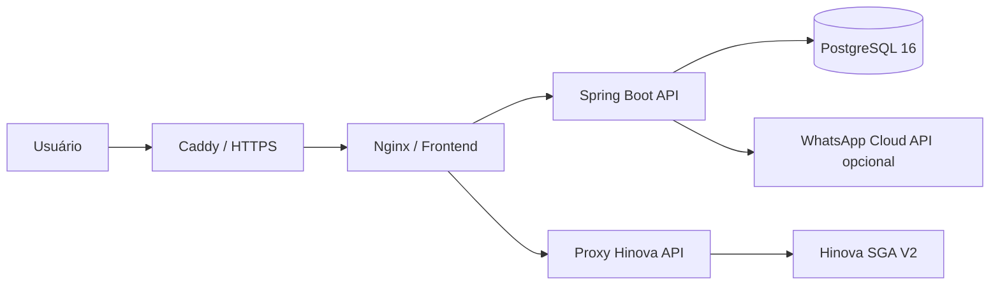
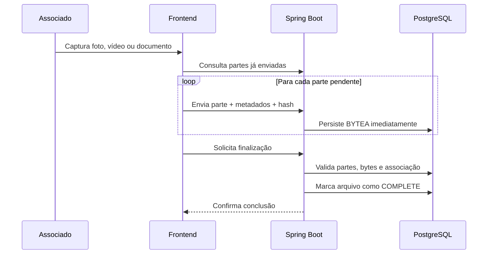

<p align="center">
  
</p>

<h1 align="center">Plataforma Novo Horizonte</h1>

<p align="center">
  Plataforma institucional e operacional da <strong>Novo Horizonte Proteção Veicular</strong>, reunindo site público, cotação digital, Retrato NH, gestão de consultores, análise de vistorias, administração de planos e consulta de boletos integrada à Hinova SGA V2.
</p>

<p align="center">
  <a href="https://nhprotecao.com.br"><strong>Acessar o site em produção</strong></a>
</p>

<p align="center">
  
  
  
  
  
</p>

---

## Sumário

- [Sobre o projeto](#sobre-o-projeto)
- [Principais funcionalidades](#principais-funcionalidades)
- [Perfis de acesso](#perfis-de-acesso)
- [Arquitetura](#arquitetura)
- [Tecnologias](#tecnologias)
- [Estrutura do repositório](#estrutura-do-repositório)
- [Como executar localmente](#como-executar-localmente)
- [Variáveis de ambiente](#variáveis-de-ambiente)
- [Deploy em VPS com Docker](#deploy-em-vps-com-docker)
- [Backup e restauração](#backup-e-restauração)
- [Verificação dos arquivos no banco](#verificação-dos-arquivos-no-banco)
- [Rotas principais](#rotas-principais)
- [Segurança](#segurança)
- [Identidade visual e responsividade](#identidade-visual-e-responsividade)
- [Autor e direitos](#autor-e-direitos)

---

## Sobre o projeto

A Plataforma Novo Horizonte centraliza os principais fluxos digitais da associação em uma única solução:

- apresentação institucional e captação de associados;
- cálculo e emissão de cotações;
- aceite ou recusa de propostas;
- geração de PDF da cotação;
- criação e acompanhamento de vistorias digitais;
- captura guiada de fotos, vídeo, documentos e assinatura;
- armazenamento dos arquivos diretamente no PostgreSQL;
- análise e decisão das vistorias;
- gestão de consultores, planos, faixas de preço e coberturas;
- consulta de segunda via de boleto pela API Hinova SGA V2;
- comunicação com associados por WhatsApp.

O sistema foi projetado para funcionar em celulares, tablets, notebooks e desktops, mantendo a identidade visual oficial da Novo Horizonte.

---

## Principais funcionalidades

### Site institucional

- página inicial responsiva;
- apresentação dos benefícios da proteção veicular;
- chamadas para cotação e atendimento 24 horas;
- página de escritórios e filiais com links para rotas;
- página de contato;
- links para aplicativo e regulamento institucional;
- identidade visual baseada em azul profundo, amarelo e branco.

### Cota NH

- cotação digital para diferentes categorias de veículos;
- seleção de região, plano, coberturas e opcionais;
- regra especial para motocicletas nacionais e importadas;
- consulta de faixas de preço configuradas no painel administrativo;
- cálculo automático do valor mensal;
- validade da proposta;
- aceite ou recusa pelo associado;
- geração de PDF;
- suporte a veículo zero quilômetro sem placa.

### Painel do consultor

- vínculo das atividades por consultor, independentemente da origem do cadastro;
- suporte a consultores importados, cadastrados no portal e voluntários;
- visualização das próprias cotações e vistorias;
- reabertura ou refação de cotação vencida;
- exclusão de cotações próprias;
- edição segura de dados cadastrais sem alteração de valores comerciais;
- criação e início de vistoria;
- visualização e download dos documentos enviados;
- envio de mensagem ao associado solicitando arquivos;
- comunicação de conclusão da vistoria por WhatsApp.

### Edição segura de cotação

O consultor pode corrigir:

- nome do associado;
- CPF;
- WhatsApp;
- placa;
- modelo;
- ano de fabricação;
- indicação de veículo zero quilômetro.

Permanecem protegidos no backend:

- valor FIPE;
- categoria;
- região;
- origem da motocicleta;
- plano;
- coberturas;
- opcionais;
- taxas;
- valor base e valor mensal.

Antes de confirmar a edição, o backend compara uma fotografia dos dados comerciais. Qualquer alteração indevida cancela a transação.

### Retrato NH

- criação de link público individual para a vistoria;
- fluxo específico para nova vistoria e atualização de boleto;
- captura guiada de fotos conforme o tipo de veículo;
- selfie na frente do veículo com correção de orientação da câmera frontal;
- gravação de vídeo pelo navegador;
- envio de CRLV, RG ou CNH;
- assinatura digital pelo associado;
- envio retomável em partes;
- confirmação de integridade antes da conclusão;
- geração de relatório PDF;
- disponibilidade dos arquivos para consultor, analista e administrador;
- política configurável de retenção, com padrão de 40 dias.

### Armazenamento dos arquivos no PostgreSQL

Os arquivos do Retrato NH não dependem de uma pasta permanente no servidor. Cada parte recebida é salva imediatamente no PostgreSQL.

O fluxo utiliza:

- `inspection_asset_blobs`: sessão e metadados do arquivo;
- `inspection_asset_blob_chunks`: partes binárias armazenadas em `BYTEA`;
- tamanho e índice de cada parte;
- hash SHA-256 da parte;
- estados `UPLOADING` e `COMPLETE`;
- validação da quantidade total de partes e bytes;
- limpeza automática de sessões abandonadas e conteúdos expirados.

Esse modelo evita o cenário em que o arquivo permanece apenas no disco do servidor sem registro definitivo no banco.

### Painel do analista

- listagem das vistorias disponíveis para análise;
- visualização dos dados do associado e do veículo;
- acesso às fotos, vídeos, documentos, assinatura e relatório;
- alteração do status da vistoria;
- aprovação ou reprovação;
- registro de comunicação da decisão.

### Painel administrativo

- visão geral com indicadores de consultores, cotações, propostas e Retratos NH;
- resumo por status;
- gestão de consultores;
- gestão de cotações e vistorias;
- gestão de planos;
- gestão de faixas de preço;
- gestão de coberturas e opcionais;
- configuração de destinos de e-mail e WhatsApp;
- histórico de alterações do catálogo;
- auditoria das ações administrativas.

### Segunda via de boleto

- consulta por CPF ou CNPJ;
- integração com a API oficial Hinova SGA V2;
- agrupamento dos boletos por placa;
- bloqueio de emissão em situações de atraso crítico;
- exibição do boleto vencido mais antigo quando necessário;
- tratamento de placa inativa ou cancelada;
- download por rota intermediária protegida.

#### Regra financeira por veículo

| Situação | Comportamento |
| --- | --- |
| Sem atraso crítico | Exibe os boletos disponíveis |
| Um boleto vencido há mais do que o limite configurado | Exibe somente o vencido mais antigo e orienta contato com o financeiro |
| Dois ou mais boletos vencidos além do limite | Exibe o vencido mais antigo e informa que a placa está inativa |
| Placa cancelada | Exibe aviso de cancelamento |
| Boleto pago, baixado ou cancelado | Não é oferecido para emissão |

---

## Perfis de acesso

| Perfil | Permissões principais |
| --- | --- |
| `CONSULTANT` | Cotações, consultores, painel próprio, criação e acompanhamento de vistorias |
| `ANALYST` | Análise de vistorias e acesso aos documentos enviados |
| `ADMIN` | Acesso completo aos painéis, catálogo, usuários, auditoria e configurações |

A autenticação utiliza tokens Bearer assinados com HMAC-SHA256 e tempo de expiração configurável.

---

## Arquitetura



### Fluxo do Retrato NH



### Serviços Docker

| Serviço | Responsabilidade |
| --- | --- |
| `database` | PostgreSQL 16 e dados persistentes |
| `backend` | API Java/Spring Boot, regras de negócio e PDFs |
| `hinova-api` | Proxy Node.js para a integração Hinova |
| `web` | Nginx e aplicação frontend |
| `caddy` | Proxy público, HTTPS e redirecionamento de domínio |

---

## Tecnologias

### Backend

- Java 21;
- Spring Boot 3.4.5;
- Spring Web;
- Spring Data JPA;
- Spring Security;
- Jakarta Validation;
- PostgreSQL 16;
- Flyway;
- OpenPDF;
- Google Drive API como integração opcional/legada;
- Maven.

### Frontend

- HTML5;
- CSS3;
- JavaScript Vanilla;
- MediaDevices API para câmera e microfone;
- Canvas API para captura e assinatura;
- Fetch API;
- Nginx.

### Integrações e infraestrutura

- Hinova SGA V2;
- WhatsApp Business Cloud API opcional;
- Docker e Docker Compose;
- Caddy com HTTPS automático;
- Render Blueprint para ambiente demonstrativo;
- scripts de deploy, backup e restauração para VPS KingHost.

---

## Estrutura do repositório

```text
.
├── backend/
│   ├── src/main/java/          # Controllers, serviços, entidades e segurança
│   ├── src/main/resources/     # Configurações e migrações Flyway
│   ├── src/test/               # Testes automatizados
│   ├── Dockerfile
│   └── pom.xml
├── web/
│   ├── admin/                  # Painel administrativo
│   ├── analise/                # Painel do analista
│   ├── colaborador/            # Área do consultor
│   ├── cota/                   # Cotação digital
│   ├── retrato/                # Captura e envio da vistoria
│   ├── shared/                 # Estilos e utilitários compartilhados
│   ├── assets/                 # Logos, ícones, imagens e regulamento
│   ├── index.html
│   ├── boleto.html
│   ├── escritorios.html
│   ├── nginx.conf
│   └── Dockerfile
├── hinova-api/                 # Proxy Node.js para a Hinova SGA V2
├── deploy/kinghost/            # Scripts de VPS, backup, restore e diagnóstico
├── backups/                    # Destino local de backups, ignorados pelo Git
├── docker-compose.yml          # Ambiente local
├── docker-compose.kinghost.yml # Ambiente de produção
├── render.yaml                 # Blueprint para Render
├── .env.kinghost.example
└── README.md
```

---

## Como executar localmente

### Pré-requisitos

- Git;
- Docker Desktop ou Docker Engine;
- Docker Compose v2;
- portas `3000` e `5432` disponíveis.

### 1. Clone o repositório

```bash
git clone <URL_DO_REPOSITORIO>
cd <PASTA_DO_REPOSITORIO>
```

### 2. Crie o arquivo de ambiente

Linux ou macOS:

```bash
cp .env.kinghost.example .env
```

Windows PowerShell:

```powershell
Copy-Item .env.kinghost.example .env
```

### 3. Altere as credenciais

Edite o arquivo `.env` e defina, no mínimo:

```env
POSTGRES_PASSWORD=UMA_SENHA_FORTE
AUTH_TOKEN_SECRET=UMA_CHAVE_ALEATORIA_COM_PELO_MENOS_32_CARACTERES
CONSULTANT_USERNAME=consultor
CONSULTANT_PASSWORD=UMA_SENHA_FORTE
ANALYST_USERNAME=analista
ANALYST_PASSWORD=UMA_SENHA_FORTE
ADMIN_USERNAME=admin@exemplo.com
ADMIN_PASSWORD=UMA_SENHA_FORTE
```

> Não reutilize em produção as credenciais de desenvolvimento.

### 4. Inicie a plataforma

```bash
docker compose up -d --build
```

### 5. Confira os contêineres

```bash
docker compose ps
```

### 6. Acesse a aplicação

```text
http://localhost:3000
```

Rotas úteis:

```text
http://localhost:3000/cota/
http://localhost:3000/colaborador/
http://localhost:3000/analise/
http://localhost:3000/admin/
http://localhost:3000/boleto.html
```

### 7. Teste a API

```bash
curl http://localhost:3000/api/health
```

Resposta esperada:

```json
{
  "status": "UP",
  "service": "nh-cotacao-api"
}
```

### 8. Acompanhe os logs

```bash
docker compose logs -f backend
```

### 9. Pare o ambiente

```bash
docker compose down
```

Para preservar o banco local, não utilize `docker compose down -v`.

---

## Execução sem Docker

### Backend

```bash
cd backend
mvn spring-boot:run
```

O PostgreSQL precisa estar disponível e as variáveis de banco devem estar configuradas.

### Testes do backend

```bash
cd backend
mvn test
```

### Frontend

O frontend é estático e pode ser servido por qualquer servidor HTTP. Para validar o build destinado à Vercel:

```bash
cd web
npm install
npm run build
```

### Proxy Hinova

```bash
cd hinova-api
npm install
node server.js
```

---

## Variáveis de ambiente

### Aplicação e domínio

| Variável | Descrição |
| --- | --- |
| `DOMAIN` | Domínio principal da aplicação |
| `WWW_DOMAIN` | Domínio com `www` redirecionado para o principal |
| `LETSENCRYPT_EMAIL` | E-mail usado pelo Caddy para o certificado HTTPS |
| `PUBLIC_API_URL` | URL pública da API |
| `PUBLIC_WEB_URL` | URL pública do frontend |
| `ALLOWED_ORIGINS` | Origens autorizadas no CORS |

### PostgreSQL

| Variável | Descrição |
| --- | --- |
| `POSTGRES_DB` | Nome do banco |
| `POSTGRES_USER` | Usuário do banco |
| `POSTGRES_PASSWORD` | Senha do banco |
| `DATABASE_URL` | URL JDBC usada pelo backend |
| `DATABASE_USERNAME` | Usuário JDBC |
| `DATABASE_PASSWORD` | Senha JDBC |

### Autenticação

| Variável | Descrição |
| --- | --- |
| `AUTH_TOKEN_SECRET` | Chave HMAC com pelo menos 32 caracteres |
| `AUTH_TOKEN_HOURS` | Duração do token em horas |
| `CONSULTANT_USERNAME` | Usuário do portal do consultor |
| `CONSULTANT_PASSWORD` | Senha do consultor |
| `ANALYST_USERNAME` | Usuário do analista |
| `ANALYST_PASSWORD` | Senha do analista |
| `ADMIN_USERNAME` | Usuário administrativo |
| `ADMIN_PASSWORD` | Senha administrativa |

As senhas podem ser informadas em texto por variável de ambiente ou como hashes BCrypt iniciados por `$2`.

### Comunicação

| Variável | Descrição |
| --- | --- |
| `TEAM_WHATSAPP_NUMBER` | WhatsApp da equipe |
| `TEAM_EMAIL` | E-mail da equipe |
| `WHATSAPP_CLOUD_ENABLED` | Ativa o envio automático pela Cloud API |
| `WHATSAPP_CLOUD_API_VERSION` | Versão da Graph API |
| `WHATSAPP_CLOUD_PHONE_NUMBER_ID` | Identificador do número |
| `WHATSAPP_CLOUD_ACCESS_TOKEN` | Token da Cloud API |
| `WHATSAPP_COMPLETION_TEMPLATE_NAME` | Template de conclusão |
| `WHATSAPP_TEMPLATE_LANGUAGE` | Idioma do template |

### Retrato NH

| Variável | Descrição |
| --- | --- |
| `INSPECTION_RETENTION_DAYS` | Dias de retenção dos arquivos no PostgreSQL |
| `INSPECTION_CLEANUP_CRON` | Agendamento da limpeza automática |

### Hinova SGA V2

| Variável | Descrição |
| --- | --- |
| `HINOVA_API_BASE_URL` | URL base da API Hinova |
| `HINOVA_API_TOKEN` | Token da integração |
| `HINOVA_API_USER` | Usuário da integração |
| `HINOVA_API_PASSWORD` | Senha da integração |
| `HINOVA_API_USER_TOKEN` | Token de usuário autenticado |
| `HINOVA_ASSOCIADO_CPF_PATH` | Rota complementar de consulta por CPF |
| `HINOVA_ASSOCIADO_DEFAULT_PASSWORD` | Senha padrão quando exigida pela API |
| `BOLETO_MAX_DAYS_AFTER_DUE` | Limite de atraso crítico |
| `BOLETO_SEARCH_DAYS_PAST` | Janela de busca no passado |
| `BOLETO_SEARCH_DAYS_FUTURE` | Janela de busca no futuro |

---

## Deploy em VPS com Docker

### 1. Prepare o servidor

Em uma VPS Ubuntu, como usuário com `sudo`:

```bash
sudo bash deploy/kinghost/bootstrap-vps.sh
```

Esse script instala Docker, habilita o serviço e libera as portas SSH, HTTP e HTTPS no firewall.

### 2. Clone o projeto

```bash
sudo mkdir -p /opt/nh-plataforma
sudo chown "$USER":"$USER" /opt/nh-plataforma
cd /opt/nh-plataforma
git clone <URL_DO_REPOSITORIO> nh-plataforma-demo-main
cd nh-plataforma-demo-main
```

### 3. Configure o ambiente

```bash
cp .env.kinghost.example .env
nano .env
```

Troque todos os valores iniciados por `TROQUE_`.

### 4. Publique

```bash
bash deploy/kinghost/deploy.sh
```

### 5. Confira os serviços

```bash
docker compose --env-file .env -f docker-compose.kinghost.yml ps
```

### 6. Veja os logs

```bash
bash deploy/kinghost/logs.sh
```

### Atualização por Git

```bash
cd /opt/nh-plataforma/nh-plataforma-demo-main
bash deploy/kinghost/update.sh
```

O script cria um backup, executa `git pull --ff-only`, reconstrói os serviços e remove imagens Docker sem uso.

> Nunca execute `docker compose down -v` em produção. A opção `-v` remove os volumes persistentes.

---

## Backup e restauração

### Criar backup

```bash
bash deploy/kinghost/backup.sh
```

Os backups são criados em:

```text
backups/nh-plataforma-AAAAMMDD-HHMMSS.sql.gz
```

O script:

- executa `pg_dump`;
- compacta o resultado;
- valida o arquivo com `gzip -t`;
- remove backups locais com mais de 14 dias.

### Restaurar backup

```bash
bash deploy/kinghost/restore.sh backups/nh-plataforma-AAAAMMDD-HHMMSS.sql.gz
```

A restauração exige a confirmação literal:

```text
RESTAURAR
```

---

## Verificação dos arquivos no banco

Depois de um deploy ou envio de teste, execute:

```bash
bash deploy/kinghost/verificar-arquivos-banco.sh
```

O script verifica:

- migrações de armazenamento;
- arquivos nos estados `UPLOADING` e `COMPLETE`;
- quantidade de partes no PostgreSQL;
- total de bytes gravados;
- conteúdos legados;
- arquivos completos com partes ausentes;
- metadados ativos sem conteúdo binário;
- últimos arquivos confirmados.

Resultado esperado:

```text
OK: a estrutura e os arquivos confirmados no PostgreSQL passaram na validação.
```

---

## Rotas principais

### Páginas

| Rota | Descrição |
| --- | --- |
| `/` | Site institucional |
| `/boleto.html` | Segunda via de boleto |
| `/escritorios.html` | Escritórios e filiais |
| `/cota/` | Cotação digital |
| `/colaborador/` | Painel do consultor |
| `/retrato/` | Vistoria pública por token |
| `/analise/` | Painel do analista |
| `/admin/` | Painel administrativo |

### API

| Método e rota | Descrição |
| --- | --- |
| `GET /api/health` | Saúde da API |
| `POST /api/auth/login` | Autenticação dos portais |
| `POST /api/public/quotes/options` | Simulação pública de opções |
| `POST /api/public/quotes` | Criação de cotação pública |
| `GET /api/quotes/{id}/pdf` | PDF da cotação |
| `GET /api/consultant-dashboard/{consultantId}` | Painel do consultor |
| `PATCH /api/consultant-dashboard/{consultantId}/quotes/{quoteId}` | Edição segura da cotação |
| `POST /api/inspections` | Criação de vistoria |
| `GET /api/public/inspections/{token}` | Dados da vistoria pública |
| `POST /api/public/inspections/{token}/upload-chunk` | Envio de uma parte do arquivo |
| `POST /api/public/inspections/{token}/finalize-upload` | Confirmação do arquivo |
| `GET /api/analysis/inspections` | Lista de análise |
| `GET /api/admin/quotes` | Cotações administrativas |
| `GET /api/admin/inspections` | Vistorias administrativas |
| `GET /api/admin/catalog/*` | Catálogo de planos, preços e coberturas |

As rotas administrativas exigem token Bearer e autorização por perfil.

---

## Segurança

- autenticação stateless;
- tokens assinados com HMAC-SHA256;
- verificação constante de assinatura e expiração;
- controle de acesso por perfil no Spring Security;
- CORS configurável;
- credenciais somente em variáveis de ambiente;
- validação de dados com Jakarta Validation;
- migrações validadas pelo Flyway;
- headers HTTP de segurança no Nginx;
- Content Security Policy;
- HTTPS automático no Caddy;
- contêiner do backend executado com usuário sem privilégios;
- download de boleto limitado a destinos autorizados;
- edição de cotação protegida também no backend;
- armazenamento binário com validação de partes e tamanhos;
- backup validado antes de ser considerado concluído.

### Antes de publicar no GitHub

1. confirme que `.env` não está versionado;
2. não publique tokens da Hinova ou WhatsApp;
3. não publique backups SQL;
4. troque qualquer senha exposta durante testes;
5. confira o histórico do Git caso algum segredo tenha sido commitado;
6. mantenha `HINOVA_DEBUG_RESPONSE=false` em produção.

---

## Identidade visual e responsividade

O sistema utiliza a identidade da Novo Horizonte:

```css
--nh-blue: #070c40;
--nh-yellow: #f0f000;
--nh-white: #ffffff;
```

A interface foi preparada para:

- celulares pequenos;
- celulares em modo paisagem;
- tablets;
- notebooks;
- desktops;
- monitores ultrawide;
- áreas seguras de aparelhos com notch;
- tabelas transformadas em cartões quando o espaço é insuficiente;
- botões e status sem quebra de palavras;
- câmera frontal com correção de orientação para a selfie.

---

## Autor e direitos

Desenvolvido por **Carlos Lima** para a **Novo Horizonte Proteção Veicular**.

- GitHub: [@developercarloslima](https://github.com/developercarloslima)
- LinkedIn: [Carlos Lima](https://www.linkedin.com/in/devcarloslima/)

### Direitos autorais

© 2026 Carlos Lima. Todos os direitos reservados.

A marca, o logotipo e os materiais institucionais da Novo Horizonte Proteção Veicular pertencem aos seus respectivos titulares.

Este repositório é disponibilizado para fins institucionais, demonstração e portfólio. A cópia, modificação, distribuição, revenda ou utilização comercial do código e dos ativos visuais não é permitida sem autorização prévia.
